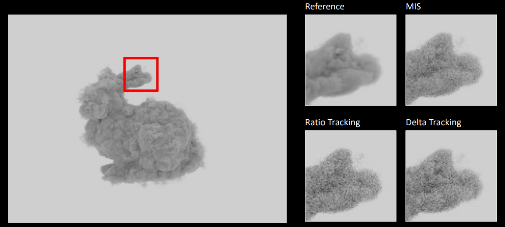

# Simple Volume



Quick and dirty implementation of the paper *A null-scattering path integral formulation of light transport, In ACM Transactions on Graphics (Proceedings of SIGGRAPH), 2019*

The repo implements delta-tracking, ratio-tracking, MIS of delta-tracking and ratio-tracking, and seperate tracking of each channel for spectrally varying participating media.

I tried spectral-MIS but it does not really work, as large ratio of contribution between each channels (at a magnitude of 10^2000) introduces NAN in the MIS weight. I did not handle that.

The code runs on CUDA and reference configs in the data folder takes roughly 20min each to finish rendering. The program takes OpenVDB data as input. 

OpenVDB files used in the sample configs can be downloaded in the following links:

+ [bunny_cloud.vdb](https://artifacts.aswf.io/io/aswf/openvdb/models/bunny_cloud.vdb/1.0.0/bunny_cloud.vdb-1.0.0.zip)
+ [smoke2.vdb](https://artifacts.aswf.io/io/aswf/openvdb/models/smoke2.vdb/1.0.0/smoke2.vdb-1.0.0.zip)

## Requirements

+ Windows
+ MSVC
+ CMake
+ CUDA

Prebuilt binaries of other dependencies are contained in the repo.

## Build

Just build with default CMake setting.

## Run

```
volume.exe <your_config_file.toml>
```